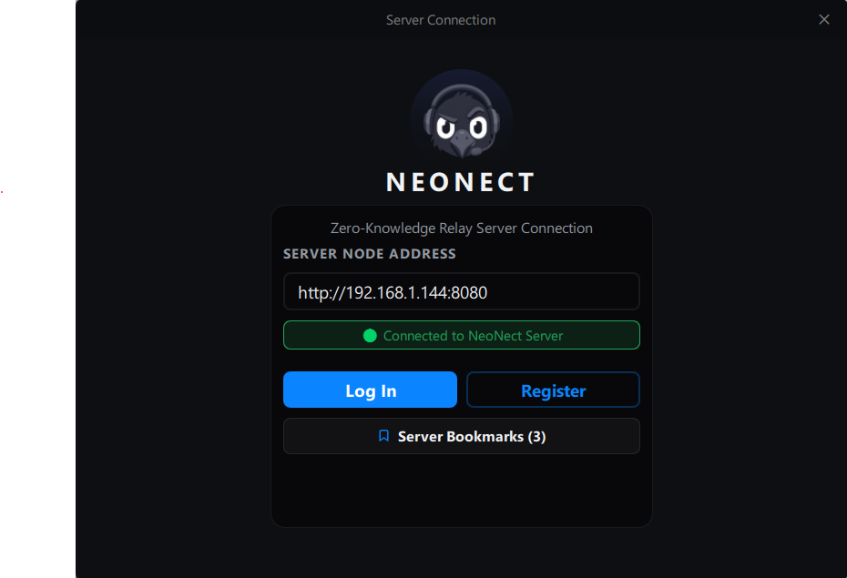
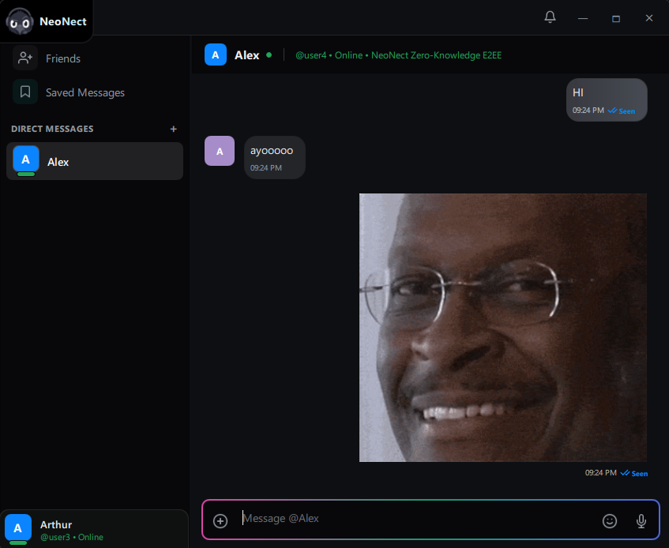

<div align="center">


# NeoNect Desktop Client

**Enterprise End-to-End Encrypted (E2EE) Secure Communication Platform**

[](https://en.cppreference.com/w/cpp/17)
[](https://www.qt.io/)
[](https://www.openssl.org/)
[](https://www.sqlite.org/)
[](https://www.docker.com/)
[](https://neonect-devs.github.io/NeoNect-desktop/)
[](LICENSE)

<p align="center">
  <a href="#-visual-showcase">Visual Showcase</a> •
  <a href="#-core-capabilities">Key Features</a> •
  <a href="#-documentation-manuals">Documentation Manuals</a> •
  <a href="#-quick-start">Quick Start</a> •
  <a href="#-docker-web-streaming">Docker</a> •
  <a href="https://neonect-devs.github.io/NeoNect-desktop/">Online Docs Site</a>
</p>

</div>

---

## 📖 Overview

**NeoNect Desktop Client** is an authentic, high-performance desktop communication client engineered with modern **C++17**, **Qt 6.5+**, **OpenSSL 3.x/4.x**, and **SQLite**. Designed from the ground up on zero-trust principles, NeoNect provides authenticated end-to-end encryption for instant messaging, live presence telemetry, waveform voice notes, media file exchange, and multi-device identity synchronization.

---

## 📸 Visual Showcase

<div align="center">

### Authentication & Session Security Vault
*Hardware-derived AES-256-GCM encryption at rest with PBKDF2 credential hashing.*



<br/>

### Real-Time E2EE Chat, Waveform Audio & Live Presence
*Fluid, reactive QML user interface with real-time WebSocket streaming and message receipts.*



</div>

---

## ⚡ Core Capabilities

* 🔒 **End-to-End Cryptographic Security**: Authenticated symmetric encryption (`AES-256-GCM`) with 128-bit integrity tags, zero nonce-reuse guarantees, and `PBKDF2-HMAC-SHA-256` ($\ge 100,000$ iterations). The relay server acts solely as a blind transport.
* ⚡ **Bidirectional Real-Time Streaming**: Low-latency `RFC 6455` WebSocket engine with automatic reconnection backoff and seamless failover to HTTP REST long-polling.
* 💾 **Active Object SQLite Persistence**: High-throughput SQLite database running in `WAL` mode on dedicated worker threads, ensuring zero UI framerate stutter during heavy I/O.
* 🎙️ **Hardware-Level Voice Notes & Audio DSP**: Low-latency PCM microphone capture, real-time waveform visualization, and variable playback speeds.
* 🎨 **Adaptive Theme Architecture**: Switch seamlessly between **Dark**, **OLED Black**, and high-contrast **Light** palettes with responsive layouts.
* 🌐 **Web Streaming via Docker**: Stream the full desktop client to any standard web browser using headless `Xvfb` and `noVNC`.

---

## 📚 Documentation Manuals

The documentation is modularized into dedicated guides:

| Guide | Description | Link |
| :--- | :--- | :--- |
| 🚀 **Getting Started** | Account setup, security vault, and first-time usage walkthrough. | [Read Guide](docs/GETTING_STARTED.md) |
| 📦 **Installation Guide** | Prebuilt binaries, system dependencies, and platform packages. | [Read Guide](docs/INSTALLATION.md) |
| 🛠️ **Compiling & Testing** | CMake configuration, building test suites, and running benchmarks. | [Read Guide](docs/BUILDING.md) |
| 🐳 **Docker Deployment** | Containerized virtual display and noVNC web streaming setup. | [Read Guide](docs/DOCKER.md) |
| 🌐 **Documentation Site** | Doxygen architecture, interactive graph viewer, and GitHub Pages. | [Read Guide](docs/DOCUMENTATION.md) |

### 🌐 Official Online Documentation Site
Explore the full architecture, API references, design patterns catalog, and interactive graph topology at:
👉 **[https://neonect-devs.github.io/NeoNect-desktop/](https://neonect-devs.github.io/NeoNect-desktop/)**

---

## 🚀 Quick Start

### 1. Clone the Repository
```bash
git clone https://github.com/NeoNect-devs/NeoNect-desktop.git
cd NeoNect-desktop
```

### 2. Configure & Build with CMake
```bash
# Configure build tree
cmake -B build -G "Ninja" -DCMAKE_BUILD_TYPE=Release

# Compile application and test suite
cmake --build build --config Release
```

### 3. Run the Client
```bash
# Windows
.\build\NeoNectApp.exe

# Linux
./build/NeoNectApp
```

### 4. Run Automated Test Suites
```bash
.\build\NeoNectTests.exe
```

---

## 🐳 Docker & Web Streaming

Run the full NeoNect desktop application inside Docker and access it via your web browser:

```bash
# Build the Docker image
docker build -t neonect-desktop .

# Run the container (published on port 6080)
docker run -d -p 6080:6080 --name neonect-client neonect-desktop
```

Open **`http://localhost:6080/`** in your browser to interact with the desktop application!

For multi-client configurations, refer to the [Docker Guide](docs/DOCKER.md).

---

## 🏗️ Architecture Summary

```
┌────────────────────────────────────────────────────────┐
│        Presentation Layer (QML / QtQuick Controls)     │
└───────────────────────────┬────────────────────────────┘
                            │ Q_PROPERTY / Q_INVOKABLE
                            ▼
┌────────────────────────────────────────────────────────┐
│           Core Presentation Facades & ViewModels       │
│  (NetworkManager, CryptoManager, AudioManager, Models) │
└───────────────────────────┬────────────────────────────┘
                            │ Service Delegation
                            ▼
┌────────────────────────────────────────────────────────┐
│                 Business Services Layer                │
│    (AuthService, FriendService, RelayService, etc.)    │
└───────────────┬────────────────────────┬───────────────┘
                │                        │
                ▼                        ▼
┌───────────────────────────────┐ ┌──────────────────────┐
│  Encrypted Repositories & SQL │ │ Cryptography (E2EE)  │
│  (SettingsRepo, SQLite WAL)   │ │ (OpenSSL AES-GCM)    │
└───────────────────────────────┘ └──────────────────────┘
```

For the comprehensive interactive architecture diagram with zoom and pan controls, visit the [Architectural Specification](https://neonect-devs.github.io/NeoNect-desktop/#mainpage) or [docs/mainpage.md](docs/mainpage.md).

---

## 📄 License

This project is licensed under the **MIT License**. See the [LICENSE](LICENSE) file for details.
